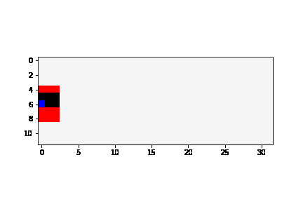
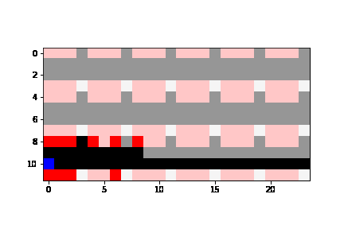
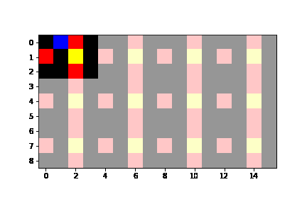

# Map-Induction

Humans are expert explorers. Understanding the computational cognitive mechanisms that support this efficiency can advance the study of the human mind and enable more efficient exploration algorithms. 
We hypothesize that humans explore new environments efficiently by inferring the structure of unobserved spaces using spatial information collected from previously explored spaces. This cognitive process can be modeled computationally using program induction in a Hierarchical Bayesian framework that explicitly reasons about uncertainty with strong spatial priors. Using a new behavioral Map Induction Task, we demonstrate that this computational framework explains human exploration behavior better than non-inductive models and outperforms state-of-the-art planning algorithms when applied to a realistic spatial navigation domain. 

## Unity Web GL builds
The compiled WebGL builds for both `Experiment1` and `Experiment2` are provided in their respective folders. The builds can be hosted using any web hosting service (e.g., simmer.io) in order to re-run the experiments and reproduce experimental results. The Unity source code used to generate these builds is available on request. Links to the WebUnity experiments are given below:  

Experiment1: http://18.25.132.202/experiment.html  
Experiment2: http://18.25.132.202/experiment3.html   

## Datasets
The `datasets` folder contains anonymized datasets from the Map Induction Task (MIT), both from `Experiment1` and `Experiment2`. Both experiments contain the following two folders:   
`data`: This folder contains raw data in csv files collected during the experiment. Each csv file corresponds to a single subject. The csv files are named using randomly generated subject IDs with a unique ID per subject.  
`visual_results`: This folder contains visualizations of the the exploration trajectories of each subject. Each pdf file corresponds to a single subject and shows the order of stimulus presentation for the given subject. The pdf files are named using the subject ids. 

### Data (csv) files content description  
Each file begins with basic information about the subject and the experiment, then lists the data from the practice stimuli and the test stimuli in the order of presentation to the subject. 

  - `Gender`: gender as reported by the subject.  
  - `ID`: randomly generated subject ID assigned to the subject at the beginning of the experiment.  
  - `Version`: Indicates the experiment design used.  
  - `<stimulus name> Time`: Time elapsed since the beginning of the trial (in seconds). The trial doesn't begin until subject moves. 
  - `<stimulus name> Diamonds`: Number of diamonds collected upto the given Time instant. 
  - `<stimulus name> X Postion`: x coordinate of the subject at the given Time instant. 
  - `<stimulus name> Z Postion`: y coordinate of the subject at the given Time instant. 
  - `<stimulus name> Camera Angle`: Head direction of the subject at the given Time instant.   
  - `<stimulus name> Start Time`: Date and Time recorded at the begining of the trial. 
  - `<stimulus name> End Time`: Date and Time recorded at the end of the trial. 
  - `Answer`: Subject's response to the instruction quiz(s). 
  - `Comments`: Comments that the subject submitted at the end of the experiment, when asked to report any strategies they used.  

## Model Illustrations
Here we show the difference between Uniform-POMCP and ML-POMCP/D-POMCP models that use map induction using simple environments. Instructions on how to run the model can be found in the `README.md` file under `model/spatial_planning`.

Uniform-POMCP without map induction  

ML-POMCP/D-POMCP with map induction  

